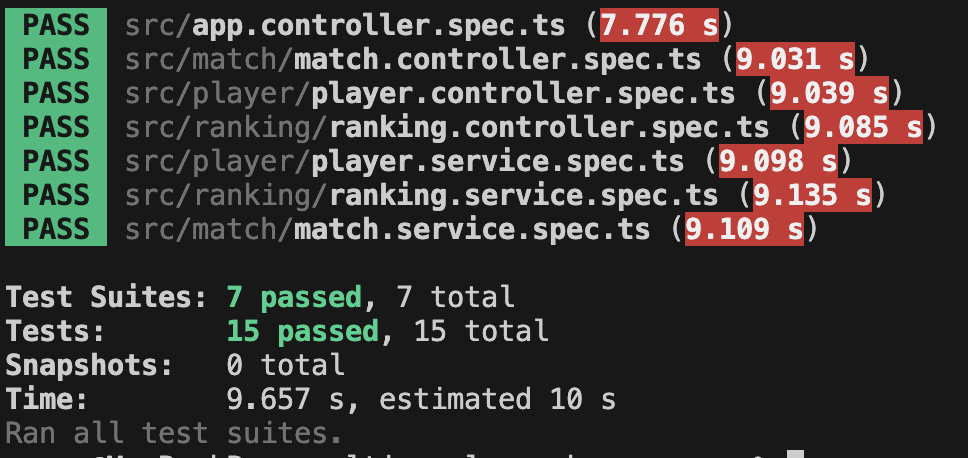

# Serveur elo ranker

### Installation

```bash
pnpm install

pnpm run libs:ui:build
```

### Lancement des tests

```bash
cd apps/realtime-elo-ranker-server
pnpm test
```

### Lancement 

```bash
pnpm run apps:server:dev

pnpm run apps:client:dev
```

**Note:** Le serveur doit etre lancé avant le client pour éviter les problèmes de port.

### Fonctionnalités

- Utilisation d'un service singleton pour le classement
- Création / récupération des informations depuis la base de données
- Ajout d'un event emitter
- Implémentation de l'api décrite par Swagger
- Module testé avec jest



#### Autre

- Les erreurs métiers sont séparées des erreurs techniques
- Utilisation de callback à la place de async/await

#### Exemple 

```bash
# Création de deux joueurs
curl -X POST "http://localhost:3000/api/player" -H "Content-Type: application/json" -d '{"id": "joueur1"}'

curl -X POST "http://localhost:3000/api/player" -H "Content-Type: application/json" -d '{"id": "joueur2"}'
```

```bash
# Création d'un match
curl -X POST "http://localhost:3000/api/match" -H "Content-Type: application/json" -d '{"winner": "joueur1", "loser": "joueur2", "draw": false}'
```

```bash
# Abonnement à l'event emitter
curl -X GET "http://localhost:3000/api/ranking/events" -H "Content-Type: application/json"
```